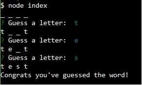

# Node-Word-Guess

Word guess game using node command line input

Deployment:
* Clone repo
* Run npm install
* At command prompt run node index.js

Technologies Used:
* NodeJS
* Javascript
* NPM Inquirer
* NPM Prompt

Author:
* Robert Weston

Screenshots

Functionality:
* Index.js will randomly select a word from an array. That word is then passed to Word.js to create a new word object that will be the word to be guessed by the user.
    * getGuess() will run npm inquirer and npm prompt to ask the user to make a guess on a letter that will be in the word. After the user makes their guess the word object will call the checkLetter function to see if the user guess matches any of the missing letters. A for each loop will check the each letter object in the word object to see if they have been guessed. If one has been guessed then it will break the loop. If statement to check if there are still remaining letters to be guessed. If there are still letters to be guessed then it will recursively called the getGuess() function to continue asking the user for guesses.
* Word.js will take in the word that is passed to it from the new object in index.js . The new word object will go through each letter and create a new letter object from letter.js.
    * Will create a local array called letterArr that will be filled with letter objects that represent each letter from the word object that has been created.
    * returnString() will create a local variable called str that will be blank initially but a for each loop will fill the string. In the loop it will get the display value from the letter object display function().
    * checkLetter() will take in a letter as a parameter that represents the users guessed letter. Will run a for each loop to check each letter in the word. On each iteration it will run a if statement to run the letter objects checkChar function will the user guess as a parameter. If it comes back true then it will change the display value using the letter objects display function. Will return the returnString() function to update the terminal with the updated remaining letters to be guessed and the letters that have been guessed.
* Letter.js will take in a letter passed to it from the new letter object created in word.js . The new letter will be given some two variables chr to represent the letter and guessed to store if the letter has been guessed by the user or not.
    * display() will check if the letter has been guessed yet and if it has then to display the letter. If it has not been guessed then will return a underscore that will represent the character
    * checkChar() will check if the passed parameter matches the chr value of the object. If they do match then changed the guessed variable to be equal to true. Returns the objects guessed value.
